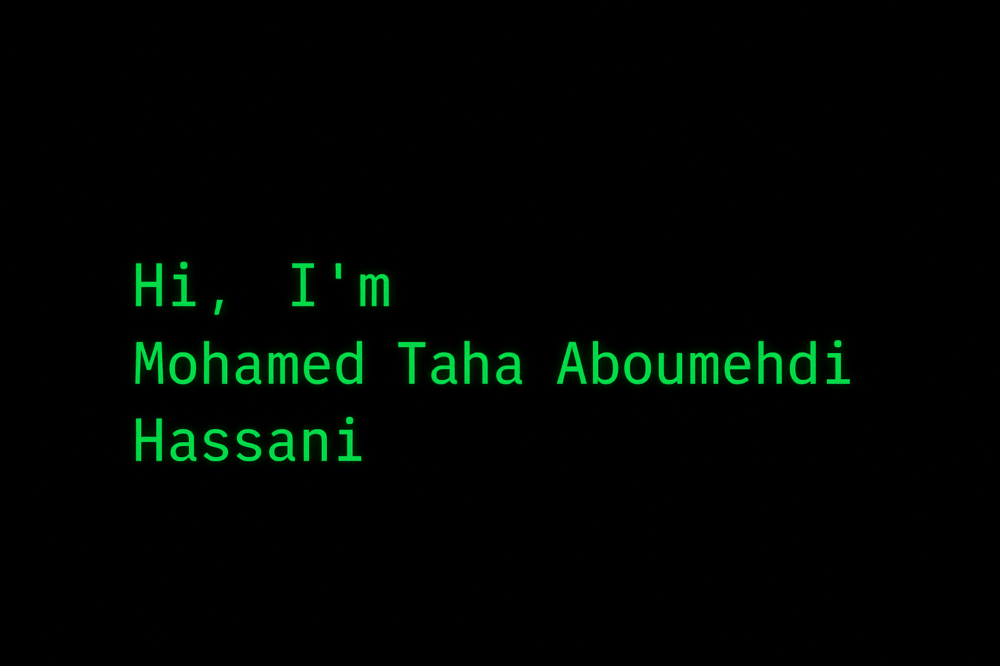

<!-- ================= PROFILE & ABOUT ================= -->

  
 

  

<h3 align="center">🏄‍♂️ Aspiring Cloud Security & DevSecOps Engineer | Offensive Cybersecurity Enthusiast & CTF Player</h3>

🎓 <strong>Location:</strong> Morocco 
💡 <strong>Passion:</strong> Building and securing web & cloud environments 
🛠️ <strong>Skills:</strong> AWS, Docker, Kubernetes, Terraform 
🛡️ <strong>Focus:</strong> Identifying vulnerabilities, implementing security best practices, enhancing system resilience through CTFs, labs & personal projects 
🚀 <strong>Approach:</strong> Taking projects from planning & design to deployment with real-world security measures 
🔍 <strong>Looking for:</strong> Internships in cybersecurity, DevSecOps, or cloud security

  

<!-- ================= CONNECT ================= -->
<h3 align="center">Connect with me:</h3>

  <a href="https://www.linkedin.com/in/taha-a-4101b5349/" target="_blank">LinkedIn</a> |
 

<!-- ================= LANGUAGES & TOOLS ================= -->
<h3 align="center">Languages & Tools:</h3>

  
  
  
  
  
  
  
  
  
  
  
  
  
  

## **💻 Projects**

### 🛠️ **Cloud Security Lab**
Deploy and secure **AWS infrastructure** using `Terraform` & `Kubernetes`.  
Focus on best practices for cloud security, automation, and monitoring.

### 🕵️‍♂️ **CTF Challenges**
Hands-on solutions for **web & network security challenges**, stored in [GitHub repo](https://github.com/mtaha-sec).  
Showcases vulnerability exploitation, analysis, and remediation skills.

### ⚡ **DevSecOps Automation**
Design and implement **CI/CD pipelines** with integrated security checks.  
Automates deployments while enforcing **DevSecOps security policies** and monitoring compliance.

## **📈 GitHub Analytics**

<picture>
  <source
    srcset="https://github-readme-stats.vercel.app/api?username=mtaha-sec&show_icons=true&bg_color=000000&title_color=00FF00&text_color=00FF00&icon_color=00FF00&border_color=00FF00"
    media="(prefers-color-scheme: dark)"
  />
  <source
    srcset="https://github-readme-stats.vercel.app/api?username=mtaha-sec&show_icons=true&bg_color=000000&title_color=00FF00&text_color=00FF00&icon_color=00FF00&border_color=00FF00"
    media="(prefers-color-scheme: light), (prefers-color-scheme: no-preference)"
  />
  
</picture>

  

